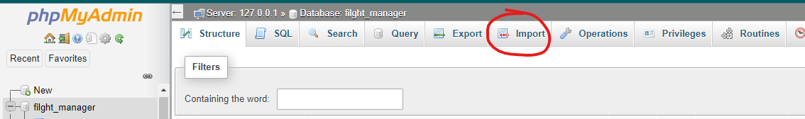
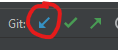

# Hướng dẫn cài đặt  
1. Backend  
> Import dữ liệu vào database . Kéo chọn file airplane.sql (tải về tại [đây](https://github.com/DauMoe/fe_dat_ve_may_bay/blob/new_ver/airplane.sql))  
> Cập nhật code bằng cách nhấn vào mũi tên như hình   
> Cập nhật xong nhấn nút chạy lại Backend 

2. Front-end  
> Clone code về tại URL: https://github.com/DauMoe/fe_dat_ve_may_bay.git  
> Mở CMD và `cd` vào thư mục vừa clone về sau đó chạy lệnh `npm start` (Phải chạy Backend thành công trước)